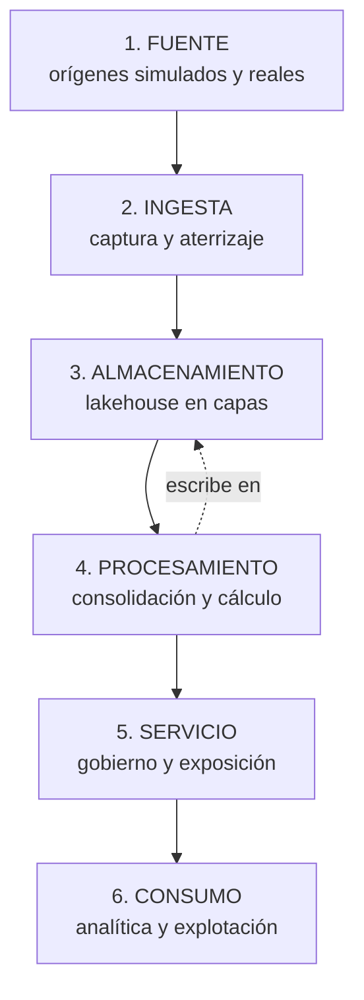

# Plataforma de datos sobre arquitectura Lakehouse

Trabajo de Fin de Máster en Big Data & Data Engineering.

Autor: Brayan Roberto Sánchez Figueroa
Repositorio: <https://github.com/brrsanchezfi/TFM_nticmaster>

---

## De qué trata

Este trabajo construye una **plataforma de datos completa sobre arquitectura
Lakehouse**, recorriendo todas sus capas, desde la fuente hasta el consumo, y
demostrando que cada una cumple su función con garantías propias.

Para que la demostración no sea teórica, la plataforma se pone a prueba con
**cuatro problemas de ingesta que en la práctica se resuelven de formas
distintas**: carga por lotes, ingesta continua desde una API, captura de cambios
en un sistema origen y propagación incremental de cambios ya ocurridos dentro
del lago. Los cuatro atraviesan las mismas capas y se apoyan en los mismos
mecanismos de almacenamiento, gobierno y consumo.

El objeto de estudio es, por tanto, **la arquitectura y su capacidad de
sostener casos heterogéneos**, no ninguna herramienta concreta.

---

## Las capas de la arquitectura



### 1. Fuente

Los orígenes de datos, simulados salvo uno.

| Caso | Origen | Naturaleza |
|---|---|---|
| Batch | Generador de ventas y catálogos maestros | Simulado |
| Streaming | API meteorológica pública | **Real** |
| CDC | Simulador de eventos de alta, cambio y baja | Simulado |
| CDF | Una tabla Delta del propio lago | Interno |

La simulación es deliberada y está delimitada: vive en directorios
`generators/`, separada de los `jobs/` que forman el pipeline, y en los logs va
enmarcada por un banner que advierte de que ese bloque **no existiría en un
entorno real**. Es una decisión de honestidad expositiva: el trabajo no
pretende que los datos sean reales, pretende que el tratamiento lo sea.

El caso CDC merece una nota. El origen iba a ser un Azure SQL con Change
Tracking, pero registrar el proveedor `Microsoft.Sql` es una operación de
suscripción y la cuenta disponible es Contributor solo del grupo de recursos.
El simulador emite exactamente el mismo contrato de datos: una fila por evento
con su tipo y su marca temporal, así que el resto de las capas no distingue
entre uno y otro.

### 2. Ingesta

La captura del dato y su aterrizaje en el lago, con trazabilidad de dónde vino
y cuándo.

Cada ingesta se declara en un contrato, no se programa. El contrato fija el
formato del origen, la ruta, el modo de carga y qué metadatos de trazabilidad
se añaden:

```json
{
  "ingest_type": "batch",
  "load_type": "full",
  "source": { "format": "json", "path": "{path.landing}/ventas" },
  "metadata": {
    "add_ingested_at": true,
    "add_ingested_date": true,
    "add_source_file": true
  }
}
```

Los mecanismos difieren según el caso: lectura por lotes para batch y CDC,
**Auto Loader** con `trigger availableNow` para streaming, que procesa lo
pendiente y termina, de modo que el cluster se apaga, y lectura del **Change
Data Feed** para CDF.

Esta capa se apoya en DKOps, una librería de ingeniería de datos desarrollada
por el autor. Es el instrumento, no el objeto: lo relevante para el trabajo es
que la ingesta quede declarada y sea reproducible, no qué librería la ejecuta.

### 3. Almacenamiento

El lago sobre ADLS Gen2 en formato Delta, organizado en la **arquitectura
medallón**. Las tres capas no son una convención de nombres: cada una responde
a una pregunta distinta y por eso admite garantías distintas.

| Capa | Qué contiene | Garantía |
|---|---|---|
| Bronze | El dato como llegó, sin depurar | Trazabilidad y reconstrucción |
| Silver | Una fila por clave de negocio, versión vigente | Unicidad y consolidación |
| Gold | Agregados listos para consumir | Coherencia interna del indicador |

Bronze está particionado por fecha de ingesta, lo que hace que reejecutar un
día concreto sea idempotente: la ingesta sobrescribe la partición en lugar de
acumular. Silver aplica la estrategia de consolidación. Gold se reconstruye por
completo, que a estos volúmenes es más simple y más seguro que mantener
incrementos.

Las dieciocho tablas son **externas**, y su ubicación reproduce su nombre
lógico:

    abfss://<capa>@<cuenta>.dfs.core.windows.net/<catálogo>/<esquema>/<tabla>

No es cosmético. Con tablas gestionadas los ficheros acaban bajo un
identificador opaco sin relación con la tabla; separar almacenamiento de
catálogo permite además que otro motor lea los mismos datos sin pasar por el
catálogo que los creó, que es la promesa del formato abierto.

### 4. Procesamiento

Donde el dato crudo se convierte en dato utilizable. Tiene dos naturalezas
distintas que conviene no mezclar.

**La consolidación** decide qué hacer cuando un registro vuelve a llegar, y se
declara en el contrato:

| Caso | Estrategia | Qué resuelve | Qué pasa con lo repetido |
|---|---|---|---|
| Batch | `full_merge` | Reemisiones de la misma venta | Se actualiza la fila existente |
| Streaming | `append_dedup` | Observaciones repetidas | Se descarta la nueva |
| CDC | `cdc_merge` | Altas, modificaciones y bajas | Gana el evento más reciente |
| CDF | (ninguna) | Cambios ya ocurridos en el lago | Se recalcula el grupo afectado |

La diferencia entre las dos primeras es sutil y de negocio: en `full_merge`
gana la última versión, en `append_dedup` la primera. Un precio corregido debe
actualizarse; una lectura de temperatura ya publicada, no. **Ese matiz vive en
un fichero de configuración, no en el código**, y hay pruebas automáticas que
verifican que cada estrategia se comporta como promete.

**El cálculo de negocio** es la otra mitad, y la que ninguna herramienta
resuelve: los KPIs, las agregaciones, las reglas del dominio. Son funciones
puras que reciben y devuelven DataFrames, sin tocar catálogos ni contratos, de
modo que se prueban con Spark local en segundos. Es la parte que el trabajo
protege con más cuidado, y donde aparecieron tres errores reales que producían
datos incorrectos sin que nada fallara.

### 5. Servicio

Cómo el dato se expone, se gobierna y se controla.

**Unity Catalog** organiza los tres catálogos por capa y un esquema por caso de
uso, con las tablas registradas, documentadas y con su linaje. Las dieciocho
tablas llevan comentario de tabla, y las columnas de negocio llevan el suyo, de
modo que el catálogo se puede navegar sin leer código.

**La observabilidad** tiene dos mecanismos con propósitos distintos: una tabla
de control común a los cuatro casos, que responde preguntas transversales
, cuántas ejecuciones fallaron, qué dataset tarda más, y alimenta un tablero; y
un log de texto por caso y subproceso, para diagnosticar una ejecución
concreta. Distinguir ambos es lo que evita usar el texto como si fuera una base
de datos.

**El acceso** se sirve por SQL Warehouse serverless, que es lo que consumen los
dashboards y las verificaciones.

### 6. Consumo

La capa donde el dato deja de ser un activo técnico y responde preguntas.

Cada caso de uso tiene su **dashboard AI/BI**, desplegado con el propio bundle,
alimentado desde Gold. No son un adorno: son la prueba de que la cadena
termina en algo consultable por alguien que no sabe qué es una partición Delta.

---

## Los cuatro casos de uso

Cada uno tiene su propia documentación, con su arquitectura, sus pruebas y sus
evidencias de ejecución.

### [1. Batch: ventas retail y modelo dimensional](use_cases/batch/README.md)

El caso piloto y el más completo. Ingiere ventas desde ficheros JSON y las
consolida resolviendo las reemisiones. Incorpora **cinco dimensiones** que
recorren la misma tubería que el hecho, lo que permite mostrar el patrón
clásico de un almacén: catálogos que se recargan enteros junto a una tabla de
hechos que crece, separados en el job en dos ramas simétricas.

### [2. Streaming: observaciones meteorológicas desde una API](use_cases/streaming/README.md)

El único caso con un origen real. Consulta una API pública y la ingiere con
Auto Loader en modo acotado. Ilustra por qué una plataforma debe distinguir
entre corregir y descartar: una observación ya publicada no se corrige.

### [3. CDC: captura de cambios sobre una cartera de clientes](use_cases/cdc/README.md)

Procesa altas, modificaciones y bajas manteniendo el estado actual de cada
cliente. Las bajas son lógicas, lo que permite auditar y contar lo que se ha
ido: con un borrado físico esas filas no existirían.

### [4. CDF: propagación incremental dentro del lago](use_cases/cdf/README.md)

El único caso cuyo origen ya está dentro del lakehouse. Lee el Change Data Feed
de una tabla Delta, deduce qué grupos del agregado quedaron desactualizados y
recalcula solo esos. Demuestra que el versionado del formato es en sí mismo una
fuente de datos.

---

## Stack

| Capa | Tecnología | Por qué |
|---|---|---|
| Fuente | Python, API pública | Generadores reproducibles por semilla |
| Ingesta | Auto Loader, lectores Delta, DKOps | Declarativa y con trazabilidad |
| Almacenamiento | ADLS Gen2 + Delta Lake | Transacciones, versionado y formato abierto |
| Procesamiento | Databricks, runtime 16.4 LTS | Spark 3.5.2 |
| Servicio | Unity Catalog, SQL Warehouse | Catálogo, linaje y control de acceso |
| Consumo | Dashboards AI/BI | Uno por caso de uso |
| Despliegue | Databricks Asset Bundles | Un bundle por caso, con su job y su dashboard |

---

## Estructura del repositorio

    docs/                 Documentación técnica (MkDocs)
    platform/             Versión fijada de la librería de ingesta
    use_cases/
      batch/              Ventas retail y cinco dimensiones
      streaming/          Observaciones meteorológicas
      cdc/                Cartera de clientes
      cdf/                Propagación incremental

Cada caso de uso es un proyecto independiente, con sus contratos, sus pruebas y
su bundle. Se despliegan y se ejecutan por separado.

---

## Ejecución

### En local

Los pipelines no necesitan Databricks para ejecutarse. Salvo Auto Loader, que
es propietario, todo el stack funciona en un portátil, y eso permite probar la
capa de procesamiento sin levantar un cluster.

    python3 -m venv ~/.venvs/tfm-batch
    ~/.venvs/tfm-batch/bin/pip install -e "use_cases/batch[local]"
    cd use_cases/batch
    ~/.venvs/tfm-batch/bin/pytest

El detalle está en [`docs/ejecucion-local.md`](docs/ejecucion-local.md).

### En Databricks

    cd use_cases/batch
    databricks bundle validate -t dev
    databricks bundle deploy -t dev

Conviene lanzar los jobs por API en lugar de con `bundle run`: este último se
queda bloqueado esperando y, si el job dura más que el token, pierde el hilo y
un fallo del cliente aparenta ser un fallo del pipeline.

---

## Resultados

Los cuatro pipelines ejecutan de extremo a extremo sin intervención manual, con
dieciocho tablas gobernadas y cuatro dashboards. Las evidencias están en el
README de cada caso.

El trabajo completo,101 ejecuciones de job y algo más de doce horas de cluster
a lo largo de tres semanas, ha consumido **4,59 DBUs**, alrededor de 1,40 USD
de cómputo Databricks a precio de lista, sin contar la máquina de Azure ni el
almacenamiento. El detalle está en [`docs/costes.md`](docs/costes.md).

### Sobre el instrumento

Someter la librería de ingesta a un uso real destapó nueve defectos, ocho ya
corregidos. No es el objeto del trabajo, pero sí un subproducto que merece
mención, porque la mayoría comparte una raíz instructiva: **qué partes de un
contrato se aplican dependía de por qué camino entrara la escritura**. Un
contrato que no se aplica igual por todos los caminos, o que nadie verifica
contra el estado real de la tabla, es documentación y no gobierno.

El detalle está en [`docs/estado.md`](docs/estado.md).

---

## Limitaciones y trabajo futuro

- El origen del caso CDC es simulado, por falta de permisos de suscripción.
- Las dimensiones se recargan por completo, así que no conservan el histórico
  de cambios de atributo. Un cliente que cambia de ciudad deja de poder
  analizarse con la que tenía al comprar.
- El caso CDF no aparece en la tabla de control, porque su pipeline no
  construye un motor de ingesta.
- Gold se reconstruye entera en los cuatro casos.

---

## Documentación

| Documento | Contenido |
|---|---|
| [`docs/estado.md`](docs/estado.md) | Estado del proyecto y bitácora de incidencias |
| [`docs/observabilidad.md`](docs/observabilidad.md) | Los dos mecanismos de registro |
| [`docs/infraestructura.md`](docs/infraestructura.md) | Unity Catalog, tablas externas y sus restricciones |
| [`docs/ejecucion-local.md`](docs/ejecucion-local.md) | Ejecutar y probar sin Databricks |
| [`docs/casos_uso/`](docs/casos_uso/) | Diseño detallado de cada caso |
