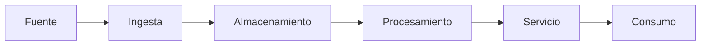

# Plataforma de datos lakehouse con cuatro patrones de procesamiento

Trabajo de Fin de Máster del Máster en Big Data & Data Engineering (UCM).

Autor: Brayan Roberto Sánchez Figueroa

Plataforma de datos con arquitectura lakehouse sobre Azure Databricks y Unity
Catalog, probada con cuatro casos de uso: batch, streaming, CDC y CDF. Los cuatro
comparten almacenamiento, gobierno, registro de ejecuciones y forma de
desplegarse. Lo que cambia entre ellos es el origen y la estrategia de
consolidación, que se declara en un contrato JSON.

## Casos de uso

| Caso | Origen | Estrategia en Silver | Documentación |
|---|---|---|---|
| Batch | Generador de ventas y cinco dimensiones | `full_merge` | [use_cases/batch](use_cases/batch/README.md) |
| Streaming | API pública de Open-Meteo | `append_dedup` | [use_cases/streaming](use_cases/streaming/README.md) |
| CDC | Simulador de altas, cambios y bajas | `cdc_merge` | [use_cases/cdc](use_cases/cdc/README.md) |
| CDF | Tabla Delta con Change Data Feed | Recálculo por grupo | [use_cases/cdf](use_cases/cdf/README.md) |

Cada caso es un proyecto independiente, con sus contratos, su lógica de negocio,
sus pruebas y su Databricks Asset Bundle.

## Arquitectura

```mermaid
flowchart LR
    F[Fuente] --> I[Ingesta] --> A[Almacenamiento]
    A --> P[Procesamiento] --> S[Servicio] --> C[Consumo]
```

| Capa | Implementación |
|---|---|
| Fuente | Generadores con semilla para batch, CDC y CDF. API pública para streaming. |
| Ingesta | Contratos de ingesta ejecutados con [DKOps](https://github.com/brrsanchezfi/DKOps). Auto Loader con `availableNow` en streaming. |
| Almacenamiento | Delta Lake sobre ADLS Gen2, en bronze, silver y gold. |
| Procesamiento | Estrategia de consolidación declarada en el contrato y funciones de negocio en PySpark. |
| Servicio | Unity Catalog, tabla de control de ejecuciones y SQL Warehouse serverless. |
| Consumo | Un dashboard AI/BI por caso, desplegado con su bundle. |

Todas las tablas son externas y su ruta reproduce el nombre lógico:

    abfss://<capa>@<cuenta>.dfs.core.windows.net/<catalogo>/<esquema>/<tabla>

Los orígenes simulados viven en `generators/`, separados de los `jobs/`, y en
los logs van marcados como simulación.

## Estructura

    docs/          Documentación técnica
    platform/      Versión fijada de DKOps
    scripts/       Despliegue de los cuatro bundles
    use_cases/
      batch/
      streaming/
      cdc/
      cdf/

## Requisitos

- Python 3.10 o superior
- Java 8, 11 o 17, para ejecutar Spark 3.5 en local
- Databricks CLI con soporte de bundles
- Acceso a un workspace de Databricks con Unity Catalog

## Ejecución en local

Cada caso lleva su propio entorno virtual:

    python3 -m venv ~/.venvs/tfm-batch
    ~/.venvs/tfm-batch/bin/pip install -e "use_cases/batch[local]"
    cd use_cases/batch
    ~/.venvs/tfm-batch/bin/pytest

Detalle en [docs/ejecucion-local.md](docs/ejecucion-local.md).

## Despliegue en Databricks

    cd use_cases/batch
    databricks bundle validate -t dev
    databricks bundle deploy -t dev
    databricks api post /api/2.2/jobs/run-now --json '{"job_id": <id>}'

Detalle en [docs/despliegue.md](docs/despliegue.md).

## Documentación

| Documento | Contenido |
|---|---|
| [docs/estado.md](docs/estado.md) | Estado, cifras e incidencias |
| [docs/infraestructura.md](docs/infraestructura.md) | Entorno, Unity Catalog y tablas externas |
| [docs/observabilidad.md](docs/observabilidad.md) | Tabla de control y logs |
| [docs/ejecucion-local.md](docs/ejecucion-local.md) | Ejecutar y probar sin Databricks |
| [docs/despliegue.md](docs/despliegue.md) | Asset Bundles y lanzamiento de jobs |
| [docs/costes.md](docs/costes.md) | Consumo medido y cómo consultarlo |

## Limitaciones

- El origen del caso CDC es simulado. El Azure SQL con Change Tracking no se
  pudo crear por falta de permisos en la suscripción.
- El streaming usa ficheros y Auto Loader en lugar de un servicio de mensajería.
- El despliegue es manual. No hay CI/CD porque no se pudo crear un service
  principal.
- Gold se reconstruye entera en los cuatro casos.
- El caso CDF no escribe en la tabla de control.
