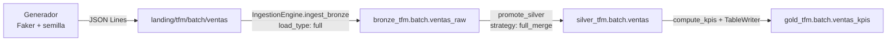

# Caso de uso: Batch (retail_sales)

## Por qué este caso va primero

Batch es el caso piloto del TFM. No se eligió por ser el más interesante —no
lo es— sino por ser el más simple: recorre la cadena completa
Terraform → Unity Catalog → DKOps → Asset Bundle con la mínima complejidad
posible. Si algo del diseño está mal, aquí se ve antes y más barato que en
streaming o CDC.

## Fuente de datos

Ventas retail sintéticas generadas con un script propio
(`src/retail_sales/generators/generate_sales.py`). El TFM no puede usar datos
de empresa, y un dataset generado tiene una ventaja adicional: permite
**provocar a voluntad las situaciones que el pipeline debe saber resolver**.

En concreto, el generador emite un 5% de ventas repetidas: la misma
`venta_id` vuelve a llegar con el importe corregido. Sin esos duplicados, la
promoción a Silver con estrategia `full_merge` no demostraría nada — cualquier
`append` daría el mismo resultado.

El generador es reproducible por semilla, de modo que un tercero puede
regenerar exactamente el mismo dataset.

## Flujo

## Decisiones de modelado

**La fecha viaja como texto hasta Gold.** El origen es JSON, que no tiene tipo
fecha. Bronze la conserva como `STRING`, fiel al dato crudo, y Silver la
mantiene igual porque su trabajo es deduplicar, no reinterpretar. Es en Gold
—la capa de consumo— donde pasa a `DATE`, que es cuando alguien va a querer
filtrar y ordenar por ella de verdad.

**Bronze se particiona por `_ingested_date`.** No es decorativo: DKOps usa esa
columna para hacer *partition overwrite*, de modo que reejecutar la ingesta el
mismo día sobreescribe la ventana del día en lugar de duplicar filas. La
ingesta es idempotente gracias a esa partición. Sin ella, DKOps avisa y cae a
`append`.

**Gold se reconstruye entera (`overwrite`).** El agregado es una foto completa
del histórico y el volumen de la PoC lo permite. Ejecutar el job dos veces no
duplica KPIs. Con volúmenes reales habría que pasar a un `upsert` por fecha.

## Tablas

| Capa | Tabla | Contenido |
|---|---|---|
| Bronze | `bronze_tfm.batch.ventas_raw` | Ventas crudas + metadatos de ingesta, particionado por día |
| Silver | `silver_tfm.batch.ventas` | Una fila por `venta_id`, la última versión conocida |
| Gold | `gold_tfm.batch.ventas_kpis` | KPIs diarios por categoría y canal |

## Papel de DKOps

Este caso no escribe lógica de ingesta: la reutiliza. El bundle aporta
únicamente **contratos** (5 ficheros JSON) y **una clase de negocio**
(`compute_kpis`). Todo lo demás —lectura del origen, enriquecimiento con
metadatos, validación contra el esquema, escritura idempotente, merge de
Silver y registro de operaciones— lo resuelve DKOps.

El único código de fontanería es `pipeline.py`, que carga los contratos y
construye el `IngestionEngine`.

## Ejecución local

    cd use_cases/batch
    pip install -e ".[local]"
    pytest tests/unit -v

Los tests son offline: no necesitan Databricks ni Unity Catalog. Los del
generador son Python puro; los de `compute_kpis` levantan un Spark local.

## Despliegue

    databricks bundle validate -t dev
    databricks bundle deploy -t dev
    databricks bundle run retail_sales_pipeline -t dev

El job encadena tres tareas —`ingest_bronze`, `promote_silver`, `build_gold`—
sobre un único job cluster compartido, que se levanta una vez y se apaga al
terminar la última.
