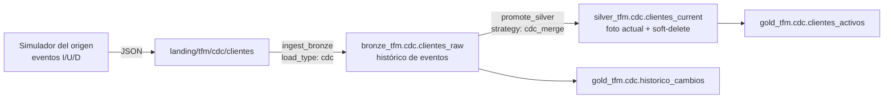

# Caso de uso: CDC (customers)

## Qué es CDC y qué lo diferencia

En los otros casos, la fuente entrega **datos**: ventas, lecturas
meteorológicas. En CDC la fuente entrega **operaciones**: "se dio de alta este
cliente", "cambió de segmento", "se dio de baja".

Eso cambia el problema. Ya no basta con acumular o deduplicar: hay que
*interpretar* cada evento y reconstruir el estado actual de cada entidad. Una
baja no es una fila menos que ingerir, es una instrucción de borrado que hay
que aplicar.

## El origen: por qué no hay Azure SQL

El diseño previsto usaba **Change Tracking de Azure SQL** sobre una base
operacional. No fue posible: el resource provider `Microsoft.Sql` figura como
`NotRegistered` en la suscripción, y registrarlo requiere permisos de
suscripción que la cuenta del TFM no tiene (es Contributor solo del Resource
Group).

La alternativa implementada es un **simulador del sistema origen** que emite
exactamente el mismo contrato de datos: una fila por evento con `op_type`
(`I`/`U`/`D`) y `op_ts`.

Esto no debilita el caso, y conviene argumentarlo bien en la defensa: **lo que
el TFM demuestra es el tratamiento del feed**, no su captura. Deduplicar por
clave, aplicar el último evento por marca temporal y marcar las bajas sin
borrarlas es idéntico venga el evento de Change Tracking, de Debezium, de un
log de Kafka o de un fichero. La pieza que cambiaría es el productor —unas
decenas de líneas—, no el pipeline.

El módulo de Terraform para Azure SQL está escrito y validado en `infra/`, listo
para activarse con `enable_cdc_sql = true` en cuanto alguien registre el
provider.

## Flujo

## Bronze guarda eventos, Silver guarda estado

Es la distinción central del caso y la razón de que existan las dos capas.

**Bronze es append-only.** Conserva todos los eventos, incluidos los de
clientes que después se dieron de baja. Nunca se actualiza ni se borra nada.
Responde a la pregunta *"qué ha pasado"*.

**Silver tiene una fila por cliente.** Aplica el último evento de cada uno y
descarta los anteriores. Responde a *"cómo está esto ahora"*.

Por eso las dos tablas de Gold se construyen desde sitios distintos:
`clientes_activos` desde Silver, porque necesita el estado actual; y
`historico_cambios` desde Bronze, porque Silver ya colapsó los eventos y no
podría reconstruir la actividad diaria.

## El watermark evita un resultado no determinista

Cuando un lote trae varios eventos del mismo cliente, hay que decidir cuál
gana. El contrato declara `watermark_col: op_ts`, y DKOps se queda con el
evento de marca temporal más alta por clave.

Sin watermark, `cdc_merge` recurre a `dropDuplicates`, que elige una fila
arbitraria: el resultado dependería del orden en que Spark leyese los ficheros
y podría cambiar entre ejecuciones con los mismos datos. Es el tipo de fallo
que no aparece en pruebas y sí en producción.

El simulador además garantiza que ningún cliente reciba una modificación y una
baja en el mismo lote, precisamente porque compartirían `op_ts`.

## Soft-delete: por qué las bajas no se borran

Cuando el último evento de un cliente es una `D`, DKOps **no elimina la fila**:
pone `is_deleted = true`. Tres razones:

- **Auditoría.** Poder responder "¿cuántos clientes se dieron de baja este
  trimestre?" exige que esas filas existan.
- **Integridad referencial.** Otras tablas pueden referenciar ese
  `cliente_id`. Borrarlo físicamente las dejaría apuntando al vacío.
- **Reversibilidad.** Una baja por error se deshace con un `UPDATE`; un
  borrado físico obliga a recuperar de un backup.

Se ve directamente en Gold: la columna `bajas` de `clientes_activos` solo puede
existir porque esas filas siguen ahí. Con borrado físico sería siempre cero.

## Tablas

| Capa | Tabla | Contenido |
|---|---|---|
| Bronze | `bronze_tfm.cdc.clientes_raw` | Todos los eventos I/U/D, append-only |
| Silver | `silver_tfm.cdc.clientes_current` | Una fila por cliente, con `is_deleted` |
| Gold | `gold_tfm.cdc.clientes_activos` | Cartera por segmento y ciudad |
| Gold | `gold_tfm.cdc.historico_cambios` | Actividad diaria por tipo de operación |

## El contraste entre los cuatro casos

Este caso completa el cuadro de estrategias de promoción, y el contraste es el
argumento más limpio a favor de un enfoque por contratos:

| Caso | Estrategia | Por qué |
|---|---|---|
| Batch | `full_merge` | Una venta puede reemitirse con el importe corregido |
| Streaming | `append_dedup` | Una observación no se corrige, solo llega repetida |
| CDC | `cdc_merge` | El origen dice explícitamente qué hacer con cada fila |

Las tres son **una línea distinta en un fichero JSON**. El código de los tres
casos es el mismo.

## Ejecución local

    cd use_cases/cdc
    pip install -e ".[local]"
    pytest tests/unit -v

Los tests cubren la lógica Gold y las garantías del simulador: que las altas no
reutilizan identificadores, que ningún cliente recibe un `U` y una `D` en el
mismo lote, y que los `UPDATE` cambian algo de verdad.

## Despliegue

    databricks bundle deploy -t dev
    databricks bundle run customers_cdc_pipeline -t dev

La primera ejecución da de alta la cartera inicial (200 clientes). Las
siguientes emiten 10 altas, 25 modificaciones y 5 bajas sobre los clientes
vigentes.

Encadenar varias ejecuciones es lo que hace visible el mecanismo: Bronze crece
con cada lote, Silver se mantiene en una fila por cliente, y las bajas se
acumulan sin desaparecer.
