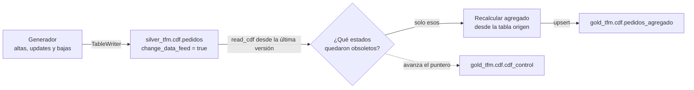

# Caso de uso: CDF (orders)

## Qué demuestra este caso

Los otros tres casos del TFM resuelven el problema de **traer datos** a la
plataforma. Este resuelve otro distinto: una vez los datos están dentro y
cambian, cómo se propagan esos cambios aguas abajo **sin volver a leerlo todo**.

Change Data Feed es una capacidad nativa de Delta Lake: si una tabla lo tiene
activado, Delta registra cada fila insertada, modificada o borrada como una
entrada consultable. Eso permite preguntar "¿qué ha cambiado desde la versión
N?" en lugar de recalcular a ciegas.

## Por qué no reutiliza la tabla de Batch

El roadmap preveía apoyarse en las tablas del caso Batch para no montar
infraestructura nueva. Se descartó por dos razones:

- **Acoplamiento entre bundles.** El caso CDF no podría desplegarse ni
  ejecutarse de forma independiente, que es uno de los criterios de éxito del
  TFM: dependería de que Batch se hubiera desplegado y ejecutado antes.
- **Control del escenario.** Las ventas de Batch se ingieren, no se editan.
  Un Change Data Feed sobre ellas casi solo vería inserciones, y el caso
  quedaría cojo: lo interesante de CDF son los `UPDATE` y los `DELETE`.

Así que CDF tiene su propia tabla origen, `silver_tfm.cdf.pedidos`, sobre la
que un generador aplica las tres operaciones.

## Flujo

## El modelo de datos

Los pedidos siguen un ciclo de vida: `nuevo` → `pagado` → `enviado` →
`entregado`, con salida a `cancelado` desde los dos primeros. Esa restricción
no es decorativa: hace que los `UPDATE` **muevan pedidos de un grupo a otro**
del agregado, que es exactamente la situación que un procesamiento incremental
mal hecho descuadra.

| Tabla | Papel |
|---|---|
| `silver_tfm.cdf.pedidos` | Origen, con `change_data_feed` activo |
| `gold_tfm.cdf.pedidos_agregado` | Agregado por estado, mantenido incrementalmente |
| `gold_tfm.cdf.cdf_control` | Puntero: hasta qué versión se ha propagado ya |

## Las dos trampas del procesamiento incremental

Este caso existe, sobre todo, por estos dos detalles. Son fáciles de pasar por
alto y ambos producen agregados incorrectos que nadie detecta hasta que
alguien cuadra los números a mano.

**1. Las preimágenes importan.** Cuando un pedido pasa de `nuevo` a `pagado`,
el feed emite dos filas: `update_preimage` con el estado viejo y
`update_postimage` con el nuevo. Un desarrollador que solo mire las
postimágenes recalculará `pagado` y se olvidará de `nuevo` — que se quedará
contando un pedido que ya no tiene, para siempre.

**2. Los grupos que se vacían.** Si el último pedido de un estado se borra o
cambia de estado, ese grupo desaparece del recálculo. Un `MERGE` solo actualiza
lo que encuentra, así que la fila vieja se queda congelada en Gold con un valor
que ya no es cierto. Hay que detectar esos grupos y borrarlos explícitamente.

Ambos comportamientos están cubiertos por tests unitarios.

## Recalcular, no acumular

Hay dos formas de mantener un agregado incremental:

- **Aplicar deltas**: sumar los importes de las inserciones y postimágenes,
  restar los de borrados y preimágenes. Es la más eficiente.
- **Recalcular los grupos afectados**: usar el feed solo para saber *qué*
  grupos tocar, y recalcular su valor desde la tabla origen.

Este caso usa la segunda. Es algo más costosa, pero **converge sola**: si una
ejecución se reprocesa por error, el resultado sigue siendo correcto porque se
recalcula desde el estado real de los datos. Con deltas acumulados, un
reproceso duplica importes y el agregado queda mal de forma permanente y
silenciosa.

La ganancia incremental se mantiene igualmente: se recalculan los estados
tocados, no la tabla entera.

## El arranque en frío no usa el feed

La primera ejecución no lee el Change Data Feed: calcula el agregado completo
desde la tabla origen y fija el puntero en la versión actual. A partir de ahí,
todo es incremental.

No es una simplificación, son dos razones independientes:

- **Conceptual**: el feed sirve para propagar cambios *a partir de* un estado
  conocido, no para construir ese estado. Preguntar "¿qué ha cambiado desde el
  principio de los tiempos?" es simplemente recalcularlo todo, dando un rodeo.
- **Técnica**: leer desde la versión 0 atraviesa la creación de la tabla, y
  Delta rechaza cualquier rango que cruce un cambio de esquema:

      DELTA_CHANGE_DATA_FEED_INCOMPATIBLE_DATA_SCHEMA
      Retrieving table changes between version 0 and 10 failed
      because of an incompatible data schema.

La primera versión del caso sí leía desde la versión 0 y fallaba exactamente
así. Es un error fácil de cometer y que no aparece en los tests unitarios,
porque solo se manifiesta contra una tabla Delta real.

## El puntero es lo que hace incremental el proceso

`cdf_control` guarda la última versión de Delta ya propagada. Cada ejecución
lee de `ultima_version + 1` hasta la versión actual, y avanza el puntero al
terminar — incluso si no hubo estados afectados, porque esas versiones ya se
han mirado.

Sin ese estado, cada ejecución tendría que leer el feed completo desde la
versión 0, y el caso no demostraría nada distinto de un recálculo total.

## Ejecución local

    cd use_cases/cdf
    pip install -e ".[local]"
    pytest tests/unit -v

Los tests cubren la lógica de propagación (preimágenes, grupos vaciados,
recálculo selectivo) y el generador (que respeta el ciclo de vida y no borra y
actualiza la misma fila en el mismo lote).

## Despliegue

    databricks bundle deploy -t dev
    databricks bundle run orders_cdf_pipeline -t dev
    databricks bundle run orders_cdf_pipeline -t dev --params lote=2

La primera ejecución siembra la tabla origen. Las siguientes aplican un lote de
cambios y propagan solo lo afectado. El parámetro `lote` cambia la semilla del
generador, de modo que cada ejecución produce un conjunto distinto de
operaciones.
