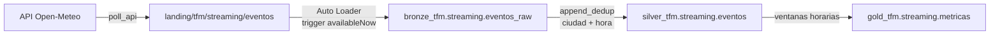

# Caso de uso: Streaming (weather_events)

## Streaming sin infraestructura de mensajería

El patrón canónico de streaming pasa por Kafka o Event Hubs. Ambos son
infraestructura de pago y permanentemente encendida, lo que choca con la
restricción de coste del TFM.

La alternativa que se implementa aquí: un job corto consulta una **API pública
gratuita** (Open-Meteo, sin autenticación) y deja un fichero JSON en la landing
zone; **Auto Loader** lo ingiere de forma incremental. El patrón conceptual es
idéntico —alguien produce eventos, otro los consume sin releer lo ya
procesado—; lo que cambia es el transporte.

## Por qué `availableNow` y no un stream continuo

Auto Loader puede correr como un stream perpetuo, con el cluster encendido
esperando ficheros. Aquí se usa el trigger `availableNow`, que procesa todo lo
pendiente y termina.

La diferencia es de coste, no de capacidad: un stream continuo mantendría una
VM encendida 24×7 para ingerir cinco lecturas cada cuarto de hora. Con
`availableNow`, el job se comporta como una ejecución acotada, el cluster se
apaga al acabar y la latencia pasa a depender de la frecuencia del schedule.

El job trae un `schedule` cada 15 minutos **en pausa**: activarlo convierte el
caso en una ingesta continua real, y desactivarlo evita consumir DBUs fuera de
las sesiones de trabajo.

## Flujo

## Las dos marcas temporales

Cada lectura guarda dos instantes distintos, y la diferencia es la clave del
caso:

| Campo | Significado |
|---|---|
| `hora` | Marca de la **observación** que devuelve la API |
| `capturado_at` | Momento en que el productor **consultó** la API |

La API publica una observación nueva cada cierto tiempo y, entre medias,
devuelve siempre la misma. Si el productor consulta cada 15 minutos pero la
observación se renueva cada hora, **cuatro consultas devuelven la misma
lectura**.

Por eso Silver deduplica por `ciudad` + `hora`: `capturado_at` cambia en cada
consulta, pero la observación es la misma y no debe contarse cuatro veces.

## Por qué `append_dedup` y no `full_merge`

Una observación meteorológica ya publicada **no se corrige**: solo llega
repetida. No hay nada que actualizar, únicamente que descartar. `append_dedup`
hace exactamente eso —un anti-join contra Silver e insertar solo lo nuevo— y
evita el coste de un `MERGE` que nunca actualizaría nada.

Es el contraste con el caso Batch, que sí usa `full_merge` porque allí una
venta puede reemitirse con el importe corregido.

## Dónde vive el estado

Auto Loader necesita dos rutas persistentes, y ambas son fáciles de olvidar:

| Ruta | Para qué |
|---|---|
| `checkpoint` | Qué ficheros se han procesado ya |
| `schemas` | El esquema inferido, con su evolución |

Por defecto DKOps las coloca bajo `/tmp`, que en Databricks vive **en el disco
del driver** y desaparece al apagarse el job cluster. Con un cluster efímero
como el de este TFM, eso significaría reingerir toda la landing en cada
ejecución y duplicar Bronze.

Ambas se configuran en `config.dev.json` apuntando a ADLS.

## Tablas

| Capa | Tabla | Contenido |
|---|---|---|
| Bronze | `bronze_tfm.streaming.eventos_raw` | Lecturas crudas, particionadas por día de ingesta |
| Silver | `silver_tfm.streaming.eventos` | Una fila por ciudad y hora de observación |
| Gold | `gold_tfm.streaming.metricas` | Media, mínima, máxima y racha por ventana horaria |

## Tolerancia a fallos del productor

Si una ciudad no responde, el productor registra el fallo y **continúa con las
demás**. Perder una lectura no justifica descartar el lote entero, y la
siguiente pasada la recuperará: la API sigue publicando la misma observación
hasta que la renueva.

## Ejecución local

    cd use_cases/streaming
    pip install -e ".[local]"
    pytest tests/unit -v

Los tests del productor simulan la respuesta de la API, así que no necesitan
red. Cubren la normalización, la tolerancia a fallos y los valores ausentes.

## Despliegue

    databricks bundle deploy -t dev
    databricks bundle run weather_events_pipeline -t dev

El job encadena cuatro tareas —`poll_api`, `ingest_bronze`, `promote_silver`,
`build_gold`— sobre un único job cluster.

Ejecutarlo varias veces seguidas es la forma de ver el mecanismo: Bronze crece
con cada lote, pero Silver solo crece cuando la API ha publicado una
observación nueva.
