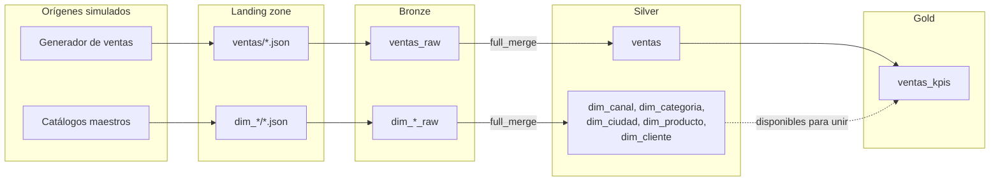

# Caso de uso 1. Batch: ventas retail y modelo dimensional

Carga por lotes de ventas retail, más cinco dimensiones que recorren la misma
tubería. Es el caso piloto del trabajo: el que valida la cadena completa con la
menor complejidad posible, y el único que muestra el patrón clásico de un
almacén, con catálogos que se recargan enteros junto a una tabla de hechos que
crece.

---

## Arquitectura



El job refleja esa forma en dos ramas simétricas que convergen:

    dims_ingest_bronze  ->  dims_promote_silver  --+
                                                   +-->  build_gold
    fact_ingest_bronze  ->  fact_promote_silver  --+

Las dos ramas corren en paralelo sobre el mismo cluster, así que la simetría no
cuesta tiempo adicional.

## La arquitectura medallón, aquí

**Bronze** guarda las ventas y los catálogos tal como llegaron, con la marca de
ingesta y el fichero de origen. Está particionado por `_ingested_date`, y eso
es lo que hace que reejecutar el mismo día sea idempotente: la ingesta
sobrescribe la partición del día en lugar de acumular.

Esa idempotencia no salió gratis. La clave del contrato es `partitions`, y
escribirla como `partition_by` hizo que el cargador la ignorase en silencio:
las tablas nacieron sin particionar, la ingesta pasó a modo *append* y Bronze
duplicó su contenido en la segunda ejecución. Silver seguía correcto, porque
`full_merge` consolida por clave, así que el fallo no daba la cara por ningún
lado salvo mirando los conteos de Bronze.

**Silver** deja una fila por clave de negocio: una por `venta_id` y una por
cada clave de dimensión. Aquí es donde actúa la estrategia declarada en el
contrato.

**Gold** agrega las ventas por fecha, categoría y canal. Se reconstruye entera
en cada ejecución.

## La estrategia: `full_merge`

```json
{
  "strategy": "full_merge",
  "merge_keys": ["venta_id"],
  "watermark_col": "_ingested_at"
}
```

El generador emite a propósito un porcentaje de ventas repetidas, para que la
estrategia tenga algo que resolver. `full_merge` las consolida quedándose con
una fila por venta.

Las cinco dimensiones usan **la misma estrategia**, cambiando solo la clave.
Ese es el punto: un catálogo se corrige, no solo se reemite. Si cambia el
precio de un producto, la fila existente debe actualizarse, así que el
comportamiento correcto es el mismo que para el hecho, y el código no distingue
entre una dimensión y una tabla de hechos.

Conviene saber lo que esta elección no da: **`full_merge` no borra**. Si un
producto desapareciera del catálogo de origen, su fila seguiría en Silver. Para
un catálogo fijo como el de este trabajo da igual, pero en un entorno real
haría falta marcar las bajas en el origen, como hace el caso CDC.

## Las dimensiones

Cinco catálogos con datos fijos escritos a mano, de volúmenes deliberadamente
distintos para mostrar que el mismo job procesa tablas de tamaños diferentes en
una sola pasada.

| Dimensión | Filas | Detalle de interés |
|---|---|---|
| `dim_canal` | 4 | Incluye un canal descatalogado, que se conserva para que las ventas históricas sigan resolviendo |
| `dim_categoria` | 6 | Libros y alimentación llevan IVA reducido |
| `dim_ciudad` | 8 | Región, país y población, para normalizar métricas por habitante |
| `dim_producto` | 12 | Referencia a `dim_categoria` y un producto retirado |
| `dim_cliente` | 20 | Referencia a `dim_ciudad`, con ciudad y segmento |

La publicación de los catálogos en la landing **es atrezo, no pipeline**. Vive
en `generators/` y no en `jobs/` precisamente para que la separación quede en
la estructura del proyecto, y en el log va delimitada por un banner:

```
========================================================================
  SIMULACION DEL ORIGEN: datos de prueba, esto NO es ingesta

  En un entorno real este bloque NO EXISTE: los ficheros los
  deja el origen y el pipeline arranca en la ingesta a Bronze.
========================================================================
  [dummy] dim_canal          4 filas -> .../landing/dim_canal
  ...
========================================================================
  FIN DE LA SIMULACION: a partir de aqui, el pipeline de verdad
========================================================================
```

---

## Pruebas de la lógica de negocio

Es la parte que el trabajo protege con más cuidado, porque es la única que no
aporta DKOps: la librería resuelve la ingesta, pero el cálculo de los KPIs es
propio y nadie más va a probarlo.

`compute_kpis` recibe y devuelve DataFrames, sin tocar catálogos ni contratos,
de modo que se puede probar con Spark local en segundos.

    pytest tests/unit -v

| Prueba | Qué protege |
|---|---|
| Agrupa por fecha, categoría y canal | La granularidad del agregado |
| Métricas de un grupo | Los valores, calculados a mano |
| La fecha se convierte a tipo `date` | En Silver es texto; Gold la entrega tipada |
| El esquema coincide con el contrato | Que el DataFrame trae exactamente lo declarado |
| **El ticket medio cuadra con importe y ventas** | La coherencia entre KPIs publicados |
| **Una venta sin importe no descuadra el ticket medio** | Un nulo en el cálculo |
| Un dataset vacío no revienta | Una landing sin ventas nuevas |

Las dos marcadas encontraron un fallo real. `avg` ignora los importes nulos y
`count(*)` no, así que una venta sin importe dejaba un ticket medio que no se
correspondía con el importe total dividido entre el número de ventas:

    ticket_medio=30.0 no cuadra con 60.0/3

Quien abriera el tablero y dividiera obtendría 20, no 30, sin que nada hubiera
fallado. La corrección fue derivar el ticket medio de las dos cifras
publicadas, de modo que la tabla sea coherente consigo misma.


---

## Ejecución en local

    python3 -m venv ~/.venvs/tfm-batch
    ~/.venvs/tfm-batch/bin/pip install -e ".[local]"
    ~/.venvs/tfm-batch/bin/pytest

Salida de una ejecución completa del ciclo con las dimensiones:

```
  dim_canal       bronze=4   silver=4
  dim_categoria   bronze=6   silver=6
  dim_ciudad      bronze=8   silver=8
  dim_producto    bronze=12  silver=12
  dim_cliente     bronze=20  silver=20
```

<!-- Captura de la ejecución local -->

---

## Ejecución en Databricks

    databricks bundle validate -t dev
    databricks bundle deploy -t dev

El despliegue construye el wheel invocando `python -m build`, así que hay que
lanzarlo desde un entorno que tenga ese paquete. Ejecutarlo desde la extensión
de VS Code conectada a un cluster falla con `No module named build`, porque usa
el Python del cluster.

Para lanzar el job conviene usar la API en lugar de `bundle run`:

    databricks api post /api/2.2/jobs/run-now --json '{"job_id": <id>}'

`bundle run` se queda bloqueado esperando a que el job termine, y si dura más
que el token de AAD pierde el hilo con un `Token is expiring within 30
seconds`. El job sigue corriendo en el servidor, pero el error aparenta ser del
pipeline cuando es solo del cliente.

<!-- Captura del job en Databricks -->

<!-- Captura del dashboard AI/BI -->

### Resultado esperado

| Capa | Tabla | Filas |
|---|---|---|
| Bronze | `ventas_raw` | 525 |
| Silver | `ventas` | 500 |
| Gold | `ventas_kpis` | 249 |
| Silver | las cinco dimensiones | 4, 6, 8, 12, 20 |

Las 525 filas de Bronze colapsan a 500 en Silver: son las 25 reemisiones que el
generador introduce a propósito.

---

## Mejoras aplicadas durante el desarrollo

**Tablas externas con ubicación legible.** Las tablas nacían gestionadas, bajo
un identificador opaco sin relación con su nombre. Ahora la ubicación reproduce
`catálogo/esquema/tabla`. Requirió reportar a DKOps que solo uno de los caminos
de escritura respetaba el `type` y la `location` del contrato.

**Idempotencia por partición.** Bronze sobrescribe la partición del día, así
que reejecutar no duplica.

**Coherencia del ticket medio**, descrita más arriba.

**Modelo dimensional.** Cinco catálogos por la misma tubería que el hecho, con
las dos ramas separadas en el job.

## Mejoras pendientes

- **Las dimensiones no se usan todavía.** `ventas` conserva `producto`,
  `categoria` y `ciudad` desnormalizados, así que los catálogos son hoy un
  modelo paralelo que nadie une. Convertirlo en un esquema en estrella real
  (que el hecho referencie por clave y Gold haga los joins) es el paso natural
  siguiente.
- **Sin dimensión de tipo 2.** La recarga completa pierde el histórico de
  cambios de atributo: un cliente que cambia de ciudad deja de poder analizarse
  con la que tenía cuando compró. `dim_cliente` sería el candidato natural.
  DKOps no ofrece hoy una estrategia que lo resuelva.
- **Sin dimensión de tiempo.** Se ha preferido no añadirla porque los KPIs
  agregan por fecha directamente y no aportaría nada al argumento.
- **Gold se reconstruye entera** en cada ejecución. Con volúmenes reales habría
  que pasar a actualizaciones incrementales por fecha.
- **El job cluster es single-node**, así que no hay ahorro por instancias spot:
  Azure exige que el driver sea on-demand.

---

## Estructura

    contracts/
      ingestion/bronze/     Landing -> Bronze  (load_type: full)
      ingestion/silver/     Bronze  -> Silver  (strategy: full_merge)
      tables/               Esquema y gobierno de las doce tablas
    dashboards/             Dashboard AI/BI de consumo
    src/retail_sales/
      pipeline.py           Cableado de DKOps
      jobs/                 Entrypoints de las tareas del job
      transformations/      Lógica de negocio: los KPIs
      generators/           Atrezo: simula los sistemas de origen
    tests/
      unit/                 Lógica de negocio
