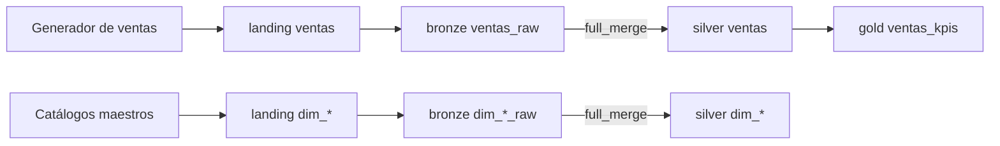

# Batch: ventas retail y modelo dimensional

Carga por lotes de ventas desde ficheros JSON, con cinco dimensiones que siguen
el mismo pipeline que la tabla de hechos.

## Flujo


```mermaid
flowchart LR
    G1[Generador de ventas] --> L1[landing ventas] --> B1[bronze ventas_raw]
    G2[Catálogos maestros] --> L2[landing dim_*] --> B2[bronze dim_*_raw]
    B1 -->|full_merge| S1[silver ventas] --> O1[gold ventas_kpis]
    B2 -->|full_merge| S2[silver dim_*]
```

El job tiene dos ramas que se ejecutan en paralelo sobre el mismo cluster y se
unen en gold:

    dims_ingest_bronze  ->  dims_promote_silver  --+
                                                   +->  build_gold
    fact_ingest_bronze  ->  fact_promote_silver  --+

## Tablas

| Capa | Tabla | Contenido |
|---|---|---|
| Bronze | `bronze_tfm.batch.ventas_raw` | Ventas tal como llegan, particionadas por `_ingested_date` |
| Bronze | `bronze_tfm.batch.dim_*_raw` | Catálogos tal como llegan |
| Silver | `silver_tfm.batch.ventas` | Una fila por `venta_id` |
| Silver | `silver_tfm.batch.dim_*` | Una fila por clave de dimensión |
| Gold | `gold_tfm.batch.ventas_kpis` | KPIs diarios por categoría y canal |

Bronze está particionado por día de ingesta. Reejecutar el mismo día sobrescribe
esa partición en lugar de duplicar filas.

La fecha llega como texto en el JSON, se mantiene como texto en bronze y silver
y se convierte a `DATE` en gold.

## Estrategia

```json
{
  "strategy": "full_merge",
  "merge_keys": ["venta_id"],
  "watermark_col": "_ingested_at"
}
```

El generador reemite un 5 % de las ventas con el importe corregido.
`full_merge` deja una fila por `venta_id` con la versión más reciente.

Las dimensiones usan la misma estrategia con su propia clave. `full_merge` no
borra: si un elemento desaparece del catálogo de origen, su fila sigue en
silver.

## Dimensiones

| Dimensión | Filas | Notas |
|---|---|---|
| `dim_canal` | 4 | Incluye un canal descatalogado |
| `dim_categoria` | 6 | Con tipo de IVA |
| `dim_ciudad` | 8 | Región, país y población |
| `dim_producto` | 12 | Referencia a `dim_categoria`, con un producto retirado |
| `dim_cliente` | 20 | Referencia a `dim_ciudad` |

Los catálogos son datos fijos. Los publica en la landing
`generators/publicar_dimensiones.py` dentro de la tarea `dims_ingest_bronze`, y
en el log ese bloque aparece marcado como simulación.

## Pruebas

    pytest tests/unit -v

13 pruebas. Cinco cubren el generador de ventas: reproducibilidad por semilla,
presencia de duplicados, coherencia del importe y formato de salida. Las otras
ocho cubren `compute_kpis`:

| Prueba | Qué comprueba |
|---|---|
| `test_agrupa_por_fecha_categoria_y_canal` | Granularidad del agregado |
| `test_metricas_de_un_grupo` | Valores calculados a mano |
| `test_fecha_se_convierte_a_tipo_date` | Tipo de la fecha en gold |
| `test_incluye_marca_de_generacion` | Columna `_generated_at` |
| `test_ticket_medio_cuadra_con_importe_y_ventas` | `ticket_medio` = `importe_total` / `num_ventas` |
| `test_una_venta_sin_importe_no_descuadra_el_ticket_medio` | Ventas con importe nulo |
| `test_un_dataset_vacio_no_revienta` | Landing sin ventas nuevas |
| `test_esquema_coincide_con_el_contrato_gold` | Columnas y tipos del contrato |

El ticket medio se calculaba con `avg`, que ignora los importes nulos, mientras
que `num_ventas` los cuenta. Con una venta sin importe, `ticket_medio` no
coincidía con `importe_total / num_ventas`. Ahora se calcula a partir de esas
dos columnas.

## Ejecución

En local:

    python3 -m venv ~/.venvs/tfm-batch
    ~/.venvs/tfm-batch/bin/pip install -e ".[local]"
    ~/.venvs/tfm-batch/bin/pytest

En Databricks:

    databricks bundle validate -t dev
    databricks bundle deploy -t dev
    databricks api post /api/2.2/jobs/run-now --json '{"job_id": <id>}'

Resultado esperado:

| Tabla | Filas |
|---|---|
| `bronze_tfm.batch.ventas_raw` | 525 |
| `silver_tfm.batch.ventas` | 500 |
| `gold_tfm.batch.ventas_kpis` | 249 |

## Limitaciones

- Las ventas guardan `producto`, `categoria` y `ciudad` desnormalizados. Gold no
  hace joins con las dimensiones todavía.
- Las dimensiones se recargan enteras y no guardan histórico de cambios (no hay
  tipo 2).
- No hay dimensión de tiempo.
- Gold se reconstruye entera en cada ejecución.

## Estructura

    contracts/
      ingestion/bronze/     Landing a bronze
      ingestion/silver/     Bronze a silver (full_merge)
      tables/               Contratos de las doce tablas
    dashboards/             Dashboard AI/BI
    resources/              Job y dashboard del bundle
    src/retail_sales/
      pipeline.py           Carga de contratos y motor de ingesta
      jobs/                 Entry points de las tareas
      transformations/      KPIs de gold
      generators/           Datos simulados
    tests/unit/
