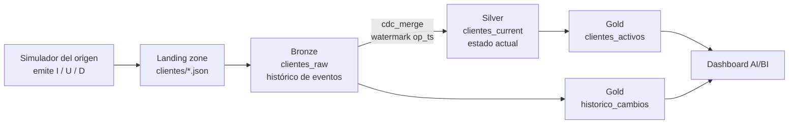

# Caso de uso 3: CDC: captura de cambios sobre una cartera de clientes

Captura y aplicación de cambios (altas, modificaciones y bajas) desde un
sistema origen transaccional, manteniendo en Silver el estado actual de cada
cliente. Las bajas son lógicas, no físicas.

---

## Arquitectura



Cuatro tareas encadenadas: `simulate_source` -> `ingest_bronze` ->
`promote_silver` -> `build_gold`.

Nótese que Gold se alimenta de **las dos capas**: la cartera vigente sale de
Silver, pero la actividad diaria del sistema origen sale de Bronze. Es un buen
ejemplo de por qué conservar el histórico crudo tiene valor propio: esa
pregunta no se puede responder desde el estado actual.

## El origen es simulado, y por qué

El diseño preveía Change Tracking sobre Azure SQL. No fue posible: el proveedor
`Microsoft.Sql` está sin registrar en la suscripción y registrarlo es una
operación de nivel suscripción que excede los permisos disponibles.

En su lugar, el simulador emite **el mismo contrato de datos** que emitiría
Change Tracking: una fila por evento con `op_type` (`I`, `U`, `D`) y `op_ts`.
El pipeline que los procesa sería idéntico con un origen real, y esa es la
razón por la que la sustitución no invalida la demostración: lo que se prueba
es el tratamiento, no la procedencia.

La simulación está delimitada. Vive en `generators/`, separada de los `jobs/`.

## La arquitectura medallón, aquí

**Bronze** es un histórico *append-only* de eventos. Nunca se actualiza ni se
borra: es el registro de lo que el origen dijo que pasó.

**Silver** es la foto actual: una fila por cliente, con la última versión
conocida y una marca `is_deleted`. Aquí es donde el flujo de eventos se
convierte en estado.

**Gold** produce dos tablas de naturaleza distinta, como se explica arriba.

## La estrategia: `cdc_merge`

```json
{
  "strategy": "cdc_merge",
  "merge_keys": ["cliente_id"],
  "watermark_col": "op_ts"
}
```

El watermark no es un detalle menor. Cuando un cliente trae varios eventos en
el mismo lote (una modificación y luego una baja, por ejemplo), decide cuál
gana. **Sin él, el resultado dependería del orden en que Spark leyera los
ficheros**, es decir, no sería determinista. Hay una prueba que lo verifica
poniendo el evento más reciente primero en el fichero, para que el orden de
lectura no pueda dar la respuesta correcta por casualidad.

## El soft-delete, y por qué importa

Una baja marca la fila, no la elimina. La diferencia se ve en Gold:

```sql
SELECT segmento, ciudad, activos, bajas, total
FROM gold_tfm.cdc.clientes_activos
```

Con un borrado físico, la columna `bajas` sería siempre cero, porque esas filas
no existirían. **Poder contar lo que se ha ido es precisamente lo que aporta el
borrado lógico**, y es lo que permite auditar: responder qué clientes había en
una fecha, o cuántos se dieron de baja en un periodo.

Esa elección tuvo un coste. Ver la sección de mejoras.

---

## Qué esperar entre ejecuciones

| | Bronze | Silver |
|---|---|---|
| Ejecución 1 | 200 eventos | 200 clientes |
| Cada siguiente | **+40 eventos** | **+10 filas** de alta, 5 marcadas como baja |

Bronze crece siempre porque acumula eventos. Silver crece solo con las altas:
las modificaciones actualizan filas existentes y las bajas las marcan.

### El parámetro `lote`

| Valor | Comportamiento |
|---|---|
| `0` (por defecto) | La semilla se deriva del estado de la tabla: cada ejecución emite cambios distintos |
| Explícito | Semilla fija, lote reproducible |

    databricks bundle run customers_cdc_pipeline -t dev --params lote=7

---

## Pruebas de la lógica de negocio

    pytest tests/unit -v

**El simulador de eventos**, que es Python puro:

| Prueba | Qué protege |
|---|---|
| La carga inicial son todo altas | Que el arranque en frío no invente modificaciones |
| Es reproducible con la misma semilla | Poder repetir una ejecución exacta |
| El lote trae los tres tipos de operación | Que la demostración cubra I, U y D |
| Las altas no reutilizan identificadores | Que un alta no pise a un cliente existente |
| Un cliente no se modifica y se borra en el mismo lote | Evitar un caso ambiguo |
| Los updates cambian algo de verdad | Que una modificación no sea un no-op |
| **Ninguna columna interna se filtra a la landing** | La causa del fallo más caro del proyecto |

**La lógica de Gold:**

| Prueba | Qué protege |
|---|---|
| Separa activos de bajas | Lo que aporta el soft-delete |
| Agrupa por segmento y ciudad | La granularidad |
| El histórico cuenta operaciones por día y tipo | La actividad del origen |
| El histórico separa días | Que dos fechas no se mezclen |
| **Activos + bajas siempre suman el total** | El cuadre de la cartera |
| Una cartera vacía no revienta | Un despliegue recién hecho |

La penúltima encontró un fallo real, y es el mismo modo de fallo que ya había
costado caro antes: con `is_deleted` a NULL, una fila no entraba ni en
`activos` ni en `bajas` pero sí en `total`, así que el cuadre se rompía en
silencio.

    activos=1  bajas=1  total=3

La corrección trata el nulo como cliente vigente, el mismo criterio que usan
los filtros del pipeline. Lo importante es que **la agregación ya no depende de
una garantía externa**: si alguna vez vuelve a llegar un nulo, el resultado
falla en vez de mentir.


---

## El fallo más instructivo del proyecto

Merece contarse entero porque resume por qué este caso necesita las pruebas que
tiene.

El simulador leía Silver para generar el lote siguiente, de modo que los
cambios fueran coherentes con lo que había. Al hacerlo, **arrastraba las
columnas internas de Silver hasta la landing**, entre ellas `is_deleted`. Eso
provocó que la columna llegara como NULL en Bronze.

En SQL, `NOT NULL` no es `TRUE`: es NULL. Así que el filtro que seleccionaba
los clientes vigentes devolvía **cero filas, sin error**. El pipeline terminaba
en verde. Cinco ejecuciones consecutivas produjeron datos incorrectos sin que
nada fallara.

Se corrigió en dos frentes: el simulador proyecta ahora solo los campos del
origen, y los filtros usan `IS NOT TRUE` en lugar de `NOT`. Y se reportó a la
librería de ingesta, que garantiza desde entonces que `is_deleted` llegue como
`true` o `false`, nunca nulo.

La lección, que vale para toda la memoria: **el modo de fallo caro no es el que
revienta, es el que termina en verde con el dato mal**.

---

## Ejecución en local

    python3 -m venv ~/.venvs/tfm-cdc
    ~/.venvs/tfm-cdc/bin/pip install -e ".[local]"
    ~/.venvs/tfm-cdc/bin/pytest

Salida de una comprobación manual del ciclo completo:

```
1. carga inicial: 50 altas
3. lote de cambios: {'U': 25, 'I': 10, 'D': 5}
4. silver total    = 60
5. is_deleted NULL = 0
6. activos=55 | bajas=5
```

<!-- Captura de la ejecución local -->

---

## Ejecución en Databricks

    databricks bundle validate -t dev
    databricks bundle deploy -t dev
    databricks api post /api/2.2/jobs/run-now --json '{"job_id": <id>}'

<!-- Captura del job en Databricks -->

<!-- Captura del dashboard AI/BI -->

---

## Mejoras aplicadas durante el desarrollo

**La fuga de columnas internas**, descrita arriba, con su prueba.

**El cuadre de la cartera** ante valores nulos.

**Filtros con `IS NOT TRUE`** en lugar de `NOT`, en todo el caso.

## Mejoras pendientes

- **Sin origen real.** Es la limitación de fondo, y no depende del trabajo sino
  de los permisos de la suscripción.
- **Sin histórico de versiones por cliente.** Silver guarda el estado actual;
  reconstruir cómo estaba un cliente en una fecha exige leer Bronze y
  reproducir los eventos. Una tabla de tipo 2 lo resolvería.
- **Las bajas no se purgan nunca.** Un cliente dado de baja permanece
  indefinidamente. En un sistema real habría que decidir una política de
  retención, y probablemente encajaría con obligaciones de protección de datos.
- **Gold se reconstruye entera** en cada ejecución.

---

## Estructura

    contracts/
      ingestion/bronze/     load_type: cdc
      ingestion/silver/     strategy: cdc_merge, watermark op_ts
      tables/
        bronze/clientes_raw.json       Histórico de eventos, append-only
        silver/clientes_current.json   Foto actual, con is_deleted
        gold/clientes_activos.json     Cartera por segmento y ciudad
        gold/historico_cambios.json    Actividad diaria por operación
    dashboards/             Dashboard AI/BI de consumo
    src/customers/
      pipeline.py           Cableado de la ingesta
      jobs/                 Entrypoints de las cuatro tareas
      transformations/      Lógica de negocio: cartera e histórico
      generators/           Atrezo: simula el sistema origen
    tests/
      unit/                 Simulador y lógica de Gold
