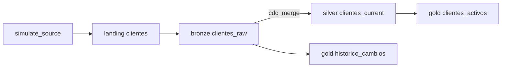

# CDC: cartera de clientes

Aplicación de altas, modificaciones y bajas de un sistema origen, manteniendo en
silver el estado actual de cada cliente. Las bajas son lógicas.

## Flujo


```mermaid
flowchart LR
    SIM[simulate_source] --> L[landing clientes]
    L --> B[bronze clientes_raw]
    B -->|cdc_merge| S[silver clientes_current]
    S --> G1[gold clientes_activos]
    B --> G2[gold historico_cambios]
```

Tareas del job: `simulate_source`, `ingest_bronze`, `promote_silver` y
`build_gold`.

## Origen

El diseño preveía Change Tracking sobre Azure SQL, pero el proveedor
`Microsoft.Sql` no está registrado en la suscripción y no hay permisos para
registrarlo. `simulate_source` escribe en la landing un fichero JSON con una
fila por evento, con `op_type` (`I`, `U`, `D`) y `op_ts`, que es el formato que
daría Change Tracking.

La primera ejecución da de alta 200 clientes. Las siguientes leen los clientes
vigentes de silver y emiten 10 altas, 25 modificaciones y 5 bajas. Del simulador
a la landing solo pasan las columnas del origen, nunca las internas de silver.

## Tablas

| Capa | Tabla | Contenido |
|---|---|---|
| Bronze | `bronze_tfm.cdc.clientes_raw` | Todos los eventos, solo se añaden |
| Silver | `silver_tfm.cdc.clientes_current` | Una fila por cliente, con `is_deleted` |
| Gold | `gold_tfm.cdc.clientes_activos` | Activos, bajas y total por segmento y ciudad |
| Gold | `gold_tfm.cdc.historico_cambios` | Operaciones por día y tipo |

`clientes_activos` se calcula desde silver. `historico_cambios` se calcula desde
bronze, porque silver ya no conserva los eventos.

## Estrategia

```json
{
  "strategy": "cdc_merge",
  "merge_keys": ["cliente_id"],
  "watermark_col": "op_ts"
}
```

Si un cliente tiene varios eventos en el mismo lote, gana el de `op_ts` más
reciente. Sin `watermark_col`, el resultado dependería del orden de lectura de
los ficheros.

Una baja no borra la fila: pone `is_deleted = true`. Así la columna `bajas` de
`clientes_activos` puede contar a los clientes que se han ido.

## Qué esperar entre ejecuciones

| | Bronze | Silver |
|---|---|---|
| Primera ejecución | 200 eventos | 200 clientes |
| Cada ejecución siguiente | +40 eventos | +10 clientes, 5 marcados como baja |

## Pruebas

    pytest tests/unit -v

7 pruebas de la lógica de gold:

| Prueba | Qué comprueba |
|---|---|
| `test_separa_activos_de_bajas` | Activos y bajas por separado |
| `test_agrupa_por_segmento_y_ciudad` | Granularidad de la cartera |
| `test_historico_cuenta_operaciones_por_dia_y_tipo` | Conteo del histórico |
| `test_el_historico_separa_dias` | Días distintos en filas distintas |
| `test_activos_mas_bajas_siempre_suman_el_total` | Cuadre con `is_deleted` nulo |
| `test_una_cartera_vacia_no_revienta` | Silver vacío |
| `test_esquemas_coinciden_con_los_contratos` | Columnas y tipos de las dos tablas |

Con `is_deleted` a NULL, un cliente no contaba ni como activo ni como baja pero
sí en el total. Ahora el nulo cuenta como cliente vigente, igual que en los
filtros del pipeline (`is_deleted IS NOT TRUE`).

## Incidencia de `is_deleted`

El simulador leía los clientes de silver con todas sus columnas y las escribía
en la landing, incluida `is_deleted`. La columna llegaba a bronze a NULL, el
filtro `NOT is_deleted` devolvía cero filas y cinco ejecuciones terminaron sin
error con datos incorrectos.

Se corrigió en tres sitios: el simulador solo escribe los campos del origen, los
filtros usan `IS NOT TRUE` y DKOps v0.3.3 garantiza que `is_deleted` llegue a
silver como `true` o `false`.

## Ejecución

En local:

    python3 -m venv ~/.venvs/tfm-cdc
    ~/.venvs/tfm-cdc/bin/pip install -e ".[local]"
    ~/.venvs/tfm-cdc/bin/pytest

En Databricks:

    databricks bundle validate -t dev
    databricks bundle deploy -t dev
    databricks api post /api/2.2/jobs/run-now --json '{"job_id": <id>}'

El parámetro `lote` fija la semilla del simulador. Con `0`, el valor por
defecto, la semilla sale del reloj y cada ejecución genera cambios distintos.
Con otro valor el lote es reproducible.

## Limitaciones

- El origen es simulado.
- Silver solo guarda el estado actual. Para ver cómo estaba un cliente en una
  fecha hay que recorrer los eventos de bronze.
- Las bajas no se purgan nunca.
- Gold se reconstruye entera en cada ejecución.

## Estructura

    contracts/
      ingestion/bronze/     load_type: cdc
      ingestion/silver/     cdc_merge con watermark op_ts
      tables/               Contratos de las cuatro tablas
    dashboards/             Dashboard AI/BI
    resources/              Job y dashboard del bundle
    src/customers/
      pipeline.py           Carga de contratos y motor de ingesta
      jobs/                 Entry points de las tareas
      transformations/      Cartera e histórico
      generators/           Simulador del origen
    tests/unit/
