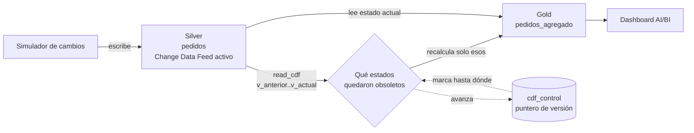

# Caso de uso 4: CDF: propagación incremental dentro del lago

Propagación de cambios usando el **Change Data Feed** de Delta Lake. Es el
único caso cuyo origen no está fuera de la plataforma sino dentro: una tabla
que ya vive en Silver.

Demuestra algo que los otros tres no pueden: **el versionado del formato de
almacenamiento es, en sí mismo, una fuente de datos**.

---

## Arquitectura



Dos tareas: `simulate_changes` -> `propagate_cdf`.

## Qué lo hace distinto

Los otros tres casos ingieren desde fuera: ficheros, una API, eventos de un
sistema origen. Este **no ingiere nada**. Los datos ya están en el lago; lo que
cambia es que alguien los ha modificado y hay que propagar esa modificación
aguas abajo sin recalcularlo todo.

Por eso no usa el motor de ingesta sino la capa de gobierno de tablas. Es una
decisión de criterio que el trabajo quiere mostrar: **usar la capa que
corresponde en lugar de forzar la que no encaja**. Un contrato de ingesta
describe un origen externo, una estrategia de consolidación y una landing zone.
Aquí no hay nada de eso.

## Cómo funciona la propagación

Delta registra cada cambio como una entrada con su tipo: `insert`, `delete`, y
para las modificaciones **dos filas**, `update_preimage` con el valor anterior
y `update_postimage` con el nuevo.

Esa pareja es la clave del caso. Un pedido que pasa de `nuevo` a `pagado` deja
obsoletos **dos** agregados, no uno: el del estado que abandona y el del estado
al que llega. Ignorar las preimágenes sería el error clásico, y dejaría al
estado de origen con un pedido de más para siempre.

El ciclo es:

1. Leer qué versión de la tabla se procesó la última vez, del puntero
2. Leer el feed desde la siguiente hasta la actual
3. Deducir qué estados aparecen en esos cambios
4. **Recalcular esos grupos desde la tabla origen**, no desde el feed
5. Escribir el agregado y avanzar el puntero

El paso 4 merece explicación. Aplicar deltas, sumar y restar importes del
feed, también funcionaría y sería más eficiente, pero es mucho más fácil de
descuadrar ante un reproceso. Recalcular desde el origen hace que el resultado
sea el correcto por construcción: **el valor de un grupo es el que resulta del
estado actual de los datos**, no el que acumule una secuencia de sumas.

## El arranque en frío

Sin puntero previo, el job calcula el agregado completo en lugar de leer el
feed. No es una optimización, es una necesidad:

    DELTA_CHANGE_DATA_FEED_INCOMPATIBLE_DATA_SCHEMA

Leer el feed desde la versión 0 atraviesa la creación de la tabla, y Delta
rechaza ese rango porque cruza un cambio de esquema. El feed sirve para
propagar cambios **a partir de** un estado conocido, no para construirlo.

## El puntero, y la alternativa que no se eligió

El caso mantiene su propia tabla de control con la última versión procesada.
Existe un patrón alternativo, más estándar, usando streaming estructurado:

```python
spark.readStream.option("readChangeFeed", "true").table(origen)
     .writeStream.option("checkpointLocation", ruta)
     .trigger(availableNow=True).toTable(destino)
```

El checkpoint gestionaría los offsets automáticamente. **No se eligió**, por
dos razones. La primera es que el destino aquí no es un volcado de filas sino
un agregado recalculado, así que haría falta `foreachBatch` y dentro iría
exactamente la misma lógica: lo único que se ganaría es la gestión de offsets.
La segunda es expositiva: `cdf_control` es una tabla consultable con un SELECT,
mientras que un checkpoint es un directorio opaco.

Dicho con honestidad: **el checkpoint sería mejor ingeniería en producción**,
porque es menos código propio que mantener. El puntero manual se justifica aquí
porque hace visible el mecanismo incremental, que es lo que el trabajo quiere
demostrar. El orden de escritura está resuelto (Gold primero, puntero después),
de modo que un fallo entre ambos reprocesa en lugar de perder cambios, y como
el recálculo parte del origen, reprocesar es idempotente.

---

## Pruebas de la lógica de negocio

    pytest tests/unit -v

Es el caso mejor cubierto de los cuatro, y sus funciones son las más
defensivas: comprueban si el conjunto de cambios está vacío y filtran los
nulos antes de agrupar.

| Prueba | Qué protege |
|---|---|
| Sin cambios no hay estados afectados | El caso de una ejecución sin novedades |
| Un insert afecta solo a su estado | Precisión del recálculo |
| **Un update afecta al estado viejo y al nuevo** | La pareja preimagen/postimagen |
| Un delete afecta a su estado | La baja |
| Recalcula solo los estados indicados | Que el incremental sea de verdad incremental |
| Métricas del agregado | Los valores, calculados a mano |
| **Detecta estados que se quedan sin pedidos** | El caso que un MERGE no cubre |
| Sin estados afectados no hay nada que vaciar | El borde del anterior |
| El esquema coincide con el contrato | Lo declarado frente a lo producido |

La tercera y la séptima son las que sostienen el caso.

La **séptima** cubre un problema que no es evidente: cuando el último pedido de
un estado se borra o cambia de estado, ese grupo desaparece del recálculo. Un
`MERGE` nunca tocaría esa fila, así que **se quedaría congelada en Gold con un
valor obsoleto para siempre**. Por eso el job la borra explícitamente.


---

## Ejecución en local

    python3 -m venv ~/.venvs/tfm-cdf
    ~/.venvs/tfm-cdf/bin/pip install -e ".[local]"
    ~/.venvs/tfm-cdf/bin/pytest

Hay un detalle que se descubrió al hacerlo funcionar en local: en Spark local
no existe el catálogo de Unity Catalog, y un nombre de tres partes se rechaza
con `REQUIRES_SINGLE_PART_NAMESPACE`. Este caso es el único que **lee tablas
por nombre** además de escribirlas, así que la resolución le tocaba a él. Se
añadió un ayudante que devuelve el identificador adecuado según el entorno.

Es una dependencia del entorno que nadie había declarado, y solo apareció al
intentar ejecutar el caso fuera de Databricks.

<!-- Captura de la ejecución local -->

---

## Ejecución en Databricks

    databricks bundle validate -t dev
    databricks bundle deploy -t dev
    databricks api post /api/2.2/jobs/run-now --json '{"job_id": <id>}'

Para observar el mecanismo, lo interesante es ejecutarlo varias veces y mirar
el puntero:

```sql
SELECT dataset, ultima_version, filas_procesadas, _actualizado_at
FROM gold_tfm.cdf.cdf_control
```

Las versiones deben avanzar **sin saltos y sin solapamientos**. Un salto
significaría cambios perdidos; un solapamiento, cambios procesados dos veces.

<!-- Captura del job en Databricks -->

<!-- Captura del dashboard AI/BI -->

---

## Mejoras aplicadas durante el desarrollo

**Arranque en frío por cálculo completo**, en lugar de leer el feed desde la
versión 0.

**Borrado de estados vaciados**, que un MERGE por sí solo no cubre.

**Altas por upsert y no por append.** Con una semilla explícita, los
identificadores generados son siempre los mismos, así que un append duplicaría
la clave al repetir el lote.

**Resolución del nombre de tabla según el entorno**, descrita arriba.

## Mejoras pendientes

- **CDF no aparece en la tabla de control de operaciones.** Como no construye
  un motor de ingesta, no instancia el registro. Es la única de las cuatro
  ramas que no se ve en el tablero de operación, y habría que instrumentarla a
  mano en sus entrypoints.
- **Las propiedades del contrato no se aplican al registrar la tabla en
  local.** El contrato declara `change_data_feed: true` y en Databricks se
  aplica, pero en local la tabla nace sin la propiedad y `read_cdf` falla con
  un error de Delta que habla de versiones y no de propiedades. El test lo
  rodea con un `ALTER TABLE`, marcado explícitamente como rodeo.
- **La validación comprueba el contrato, no la tabla.** `read_cdf` verifica que
  el contrato declare el feed, pero no que la tabla lo tenga activado. La
  comprobación está del lado equivocado: confía en el contrato justo donde el
  contrato puede mentir.
- **Sin gestión de retención del feed.** Delta conserva el histórico de cambios
  según su configuración de retención; si el puntero se quedara muy atrás, el
  rango solicitado podría haber expirado.

---

## Estructura

    contracts/
      tables/
        silver/pedidos.json            Origen, con change_data_feed activo
        gold/pedidos_agregado.json     Agregado por estado
        gold/cdf_control.json          Puntero de versiones procesadas
    dashboards/             Dashboard AI/BI de consumo
    src/orders/
      pipeline.py           Contratos y resolución de nombres por entorno
      jobs/                 Entrypoints de las dos tareas
      transformations/      Lógica de negocio: qué recalcular y qué vaciar
      generators/           Atrezo: simula los cambios sobre los pedidos
    tests/
      unit/                 Lógica del incremental
