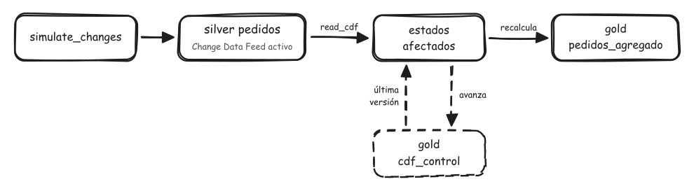

# CDF: propagación incremental

Propagación de cambios con el Change Data Feed de Delta Lake. El origen es una
tabla de silver: este caso no ingiere datos externos, sino que lleva a gold los
cambios de una tabla que ya está en el lago.

## Flujo



Tareas del job: `simulate_changes` y `propagate_cdf`.

No usa el motor de ingesta de DKOps, porque no hay landing ni estrategia de
consolidación. Lee y escribe con `TableReader` y `TableWriter`.

## Tablas

| Capa | Tabla | Contenido |
|---|---|---|
| Silver | `silver_tfm.cdf.pedidos` | Pedidos, con `change_data_feed` activo |
| Gold | `gold_tfm.cdf.pedidos_agregado` | Pedidos, unidades e importe por estado |
| Gold | `gold_tfm.cdf.cdf_control` | Última versión de `pedidos` ya propagada |

Los pedidos pasan por `nuevo`, `pagado`, `enviado` y `entregado`, y pueden
acabar en `cancelado` desde los dos primeros. `simulate_changes` crea la tabla
en la primera ejecución y después aplica altas, cambios de estado y bajas.

## Propagación

1. Leer en `cdf_control` la última versión procesada.
2. Leer el feed desde la versión siguiente hasta la actual.
3. Obtener los estados que aparecen en esos cambios.
4. Recalcular esos estados desde la tabla `pedidos` y escribirlos en gold con
   `upsert`.
5. Borrar de gold los estados que se han quedado sin pedidos.
6. Actualizar `cdf_control`.

En un cambio de estado el feed emite dos filas: `update_preimage`, con el estado
anterior, y `update_postimage`, con el nuevo. Los dos estados quedan afectados.

El paso 5 es necesario porque un `upsert` no toca los estados que ya no tienen
filas, y en gold quedaría su valor antiguo.

Los grupos se recalculan desde la tabla origen en lugar de sumar y restar los
cambios del feed. Así, volver a procesar un rango da el mismo resultado.

En la primera ejecución no hay versión previa y el agregado se calcula completo.
Leer el feed desde la versión 0 falla con
`DELTA_CHANGE_DATA_FEED_INCOMPATIBLE_DATA_SCHEMA`, porque el rango incluye la
creación de la tabla.

Gold se escribe antes que el puntero. Si el job falla entre los dos, la
siguiente ejecución vuelve a procesar el mismo rango.

## Pruebas

    pytest tests/unit -v

9 pruebas:

| Prueba | Qué comprueba |
|---|---|
| `test_sin_cambios_no_hay_estados_afectados` | Feed vacío |
| `test_un_insert_afecta_solo_a_su_estado` | Altas |
| `test_un_update_afecta_al_estado_viejo_y_al_nuevo` | Preimagen y postimagen |
| `test_un_delete_afecta_a_su_estado` | Bajas |
| `test_recalcula_solo_los_estados_indicados` | Recálculo parcial |
| `test_metricas_del_agregado` | Valores calculados a mano |
| `test_detecta_estados_que_se_quedan_sin_pedidos` | Estados vacíos |
| `test_sin_estados_afectados_no_hay_nada_que_vaciar` | Caso sin cambios |
| `test_esquema_coincide_con_el_contrato_gold` | Columnas y tipos del contrato |

## Ejecución

En local:

    python3 -m venv ~/.venvs/tfm-cdf
    ~/.venvs/tfm-cdf/bin/pip install -e ".[local]"
    ~/.venvs/tfm-cdf/bin/pytest

En local no hay Unity Catalog y los nombres de tres partes fallan con
`REQUIRES_SINGLE_PART_NAMESPACE`. `pipeline.py` devuelve el nombre de tabla
adecuado según el entorno.

En Databricks:

    databricks bundle validate -t dev
    databricks bundle deploy -t dev
    databricks api post /api/2.2/jobs/run-now --json '{"job_id": <id>}'

El parámetro `lote` fija la semilla de `simulate_changes`. Con `0`, el valor por
defecto, la semilla sale de la versión actual de la tabla. Con otro valor el lote
es reproducible, y como las altas se aplican con `upsert`, repetirlo no duplica
pedidos.

Para seguir la propagación:

```sql
SELECT * FROM gold_tfm.cdf.cdf_control;
```

`ultima_version` debe avanzar en cada ejecución sin saltar versiones.

## Limitaciones

- No escribe en la tabla de control común de ejecuciones.
- En local la tabla se crea sin la propiedad `change_data_feed` del contrato.
  El test la activa con un `ALTER TABLE`.
- `read_cdf` comprueba que el contrato declare el feed, no que la tabla lo
  tenga activado.
- No se controla la retención del feed. Si `cdf_control` quedara muy atrás, las
  versiones pendientes podrían haber caducado.
- El puntero se guarda en una tabla propia. Con Structured Streaming y
  `readChangeFeed`, el checkpoint haría ese trabajo con menos código.

## Estructura

    contracts/tables/       Contratos de las tres tablas
    dashboards/             Dashboard AI/BI
    resources/              Job y dashboard del bundle
    src/orders/
      pipeline.py           Contratos y nombres de tabla según el entorno
      jobs/                 Entry points de las tareas
      transformations/      Estados a recalcular y estados vacíos
      generators/           Simulador de cambios
    tests/unit/
