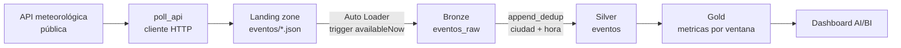

# Caso de uso 2: Streaming: observaciones meteorológicas desde una API

Ingesta incremental con Auto Loader desde una API pública, sin Kafka ni Event
Hubs. Es **el único caso del trabajo con un origen real**: los datos vienen de
un servicio externo que nadie controla, con sus formatos, sus fallos y su
cadencia propia.

---

## Arquitectura



El job encadena cuatro tareas sobre un único job cluster: `poll_api` ->
`ingest_bronze` -> `promote_silver` -> `build_gold`.

## La arquitectura medallón, aquí

**Bronze** acumula todo lo que la API devolvió, un fichero por consulta. Es
deliberado: si la API cambiara el formato o publicara un valor erróneo, aquí
queda registrado lo que llegó y cuándo.

**Silver** guarda una fila por observación real, identificada por ciudad y hora
truncada. Es donde el flujo deja de crecer cada vez que se consulta.

**Gold** agrega por ciudad y ventana horaria: temperatura media, mínima y
máxima, humedad y viento máximo.

## La estrategia: `append_dedup`

```json
{
  "strategy": "append_dedup",
  "merge_keys": ["ciudad", "hora"]
}
```

La razón es de negocio y está escrita en el propio contrato: **una observación
meteorológica ya publicada no se corrige, solo llega repetida**. No hay nada
que actualizar, solo que descartar.

Ahí está el contraste que mejor ilustra el argumento del trabajo. Batch usa
`full_merge` sobre los mismos mecanismos y con el mismo código, pero con el
comportamiento opuesto: allí una reemisión **actualiza** la fila existente,
porque un precio corregido debe prevalecer. La diferencia entre corregir y
descartar es una decisión del dominio, y vive en una línea de configuración.

## Por qué Auto Loader en modo acotado

```
trigger availableNow
```

Auto Loader mantiene el registro de qué ficheros ya procesó, de modo que la
ingesta es incremental sin que nadie lleve la cuenta. Pero en lugar de dejarlo
como un stream perpetuo, el job usa `availableNow`: procesa lo pendiente y
termina.

Eso convierte una ingesta continua en **una ejecución acotada**, con dos
consecuencias prácticas. El cluster se apaga al acabar, que a efectos de coste
es la diferencia entre céntimos y una factura mensual. Y el job se puede
orquestar como cualquier otro, con dependencias y reintentos, en vez de
requerir supervisión de un proceso siempre vivo.

El job trae un `schedule` cada 15 minutos **en pausa**. Activarlo desde la
interfaz convierte el caso en una ingesta continua real.

---

## Qué esperar entre ejecuciones

Este es el comportamiento a observar en la demostración, y no es intuitivo:

| | Bronze | Silver |
|---|---|---|
| Cada ejecución | **+5 filas**, una por ciudad | **+0** si la API no ha publicado nada nuevo |
| Cuando la API renueva | +5 filas | +5 filas |

Bronze crece siempre porque cada consulta genera un fichero. Silver solo crece
cuando hay observaciones nuevas: la API devuelve la misma lectura hasta que
publica otra.

**Si Bronze y Silver crecen igual en cada pasada, la deduplicación no está
funcionando.** Es la comprobación más rápida de que el caso hace lo que dice.

---

## Pruebas de la lógica de negocio

Dos bloques, ambos ejecutables sin Databricks.

    pytest tests/unit -v

**El cliente de la API**, que se prueba con respuestas simuladas y sin red:

| Prueba | Qué protege |
|---|---|
| Normaliza la respuesta de la API | Que el JSON externo se traduzca al esquema propio |
| `capturado_at` es distinto de la hora de observación | Dos tiempos que es fácil confundir |
| **Una ciudad caída no tumba el lote** | Que un fallo parcial del origen no pierda el resto |
| Valores ausentes no rompen la normalización | Un campo que la API omite |

La tercera merece atención: si una de las cinco ciudades falla, el lote debe
seguir con las otras cuatro. Un origen externo falla, y la plataforma no puede
depender de que no lo haga.

**La agregación por ventana horaria:**

| Prueba | Qué protege |
|---|---|
| Agrupa por ciudad y ventana | La granularidad del agregado |
| Métricas de una ventana | Los valores, calculados a mano |
| La ventana se trunca a la hora | Que dos lecturas de la misma hora caigan juntas |
| El esquema coincide con el contrato | Lo declarado frente a lo producido |
| **Mínima <= media <= máxima** | El invariante de cualquier agregación |
| **Una hora ilegible no crea una ventana nula** | Un dato de origen mal formado |

La última encontró un fallo real. La hora llega como texto desde la API y
`to_timestamp` devuelve NULL ante un formato que no reconoce; esas lecturas
acababan agrupadas en **una ventana nula**, una fila de Gold sin hora que
ningún tablero sabe dibujar. Ahora se descartan, porque una observación que no
se puede situar en el tiempo no tiene sitio en una tabla de métricas horarias.


---

## Ejecución en local

    python3 -m venv ~/.venvs/tfm-streaming
    ~/.venvs/tfm-streaming/bin/pip install -e ".[local]"
    ~/.venvs/tfm-streaming/bin/pytest

Para ver qué devuelve la API de verdad:

    python -c "from weather_events.producer.poll_api import consultar_ciudad; \
      print(consultar_ciudad('Madrid', 40.4168, -3.7038))"

<!-- Captura de la ejecución local -->

---

## Ejecución en Databricks

    databricks bundle validate -t dev
    databricks bundle deploy -t dev
    databricks api post /api/2.2/jobs/run-now --json '{"job_id": <id>}'

<!-- Captura del job en Databricks -->

<!-- Captura del dashboard AI/BI -->

---

## Mejoras aplicadas durante el desarrollo

**El estado de Auto Loader en almacenamiento persistente.** Estaba en `/tmp`,
que en un cluster efímero desaparece al apagarse: cada ejecución reingería la
landing entera y duplicaba Bronze. Las rutas `checkpoint` y `schemas` viven
ahora en el lago.

**Descarte de ventanas nulas**, descrito más arriba.

**Tolerancia a fallos parciales del origen**, con su prueba.

## Mejoras pendientes

- **Gold se reconstruye entera** en cada ejecución. Con volúmenes reales habría
  que pasar a actualizaciones incrementales por ventana.
- **Auto Loader no se puede probar en local**, porque `cloudFiles` es
  propietario. La ingesta a Bronze de este caso solo se verifica en Databricks.
- **La API tiene límite de uso gratuito.** Con cinco ciudades cada 15 minutos
  queda muy por debajo, pero subir la frecuencia o el número de ciudades podría
  provocar respuestas con error.
- **Sin control de calidad sobre el dato de origen.** Hoy se descarta lo que no
  se puede situar en el tiempo, pero no se registra cuánto se descartó ni por
  qué. Una tabla de rechazos sería el paso natural.

---

## Estructura

    contracts/
      ingestion/bronze/     Auto Loader, trigger availableNow
      ingestion/silver/     append_dedup por ciudad + hora
      tables/               Esquema y gobierno de las tres tablas
    dashboards/             Dashboard AI/BI de consumo
    src/weather_events/
      producer/             Cliente de la API, sin Spark
      pipeline.py           Cableado de la ingesta
      jobs/                 Entrypoints de las cuatro tareas
      transformations/      Lógica de negocio: agregación por ventana
    tests/
      unit/                 Cliente de la API y agregación
