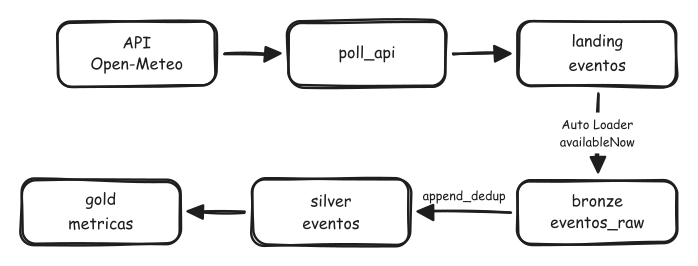

# Streaming: observaciones meteorológicas

Ingesta incremental con Auto Loader de las lecturas de una API pública
(Open-Meteo) para cinco ciudades. Es el único caso con un origen real.

## Flujo



Tareas del job: `poll_api`, `ingest_bronze`, `promote_silver` y `build_gold`,
sobre un único job cluster.

## Tablas

| Capa | Tabla | Contenido |
|---|---|---|
| Bronze | `bronze_tfm.streaming.eventos_raw` | Una fila por consulta a la API, particionada por día de ingesta |
| Silver | `silver_tfm.streaming.eventos` | Una fila por ciudad y hora de observación |
| Gold | `gold_tfm.streaming.metricas` | Temperatura media, mínima y máxima, humedad y viento por ciudad y hora |

Cada lectura tiene dos marcas de tiempo: `hora`, la de la observación que
devuelve la API, y `capturado_at`, la de la consulta. La API repite la misma
observación hasta publicar la siguiente, así que varias consultas pueden traer
la misma lectura.

## Estrategia

```json
{
  "strategy": "append_dedup",
  "merge_keys": ["ciudad", "hora"]
}
```

Una observación publicada no se corrige. `append_dedup` inserta solo las
combinaciones de ciudad y hora que no están ya en silver, y descarta el resto.

## Auto Loader

La ingesta usa `trigger availableNow`: procesa los ficheros pendientes y
termina, y el cluster se apaga al acabar el job. El `checkpoint` y los
`schemas` de Auto Loader están en ADLS, no en `/tmp`, para que se conserven
entre ejecuciones.

El job tiene una programación cada 15 minutos en pausa.

## Qué esperar entre ejecuciones

| | Bronze | Silver |
|---|---|---|
| Consulta sin observación nueva | +5 filas | +0 |
| Consulta con observación nueva | +5 filas | +5 filas |

Si una ciudad falla, `poll_api` registra el error y sigue con las demás.

## Pruebas

    pytest tests/unit -v

7 pruebas de la agregación de gold:

| Prueba | Qué comprueba |
|---|---|
| `test_agrupa_por_ciudad_y_ventana_horaria` | Granularidad del agregado |
| `test_metricas_de_una_ventana` | Valores calculados a mano |
| `test_la_ventana_se_trunca_a_la_hora` | Lecturas de la misma hora en una ventana |
| `test_esquema_coincide_con_el_contrato_gold` | Columnas y tipos del contrato |
| `test_min_y_max_encierran_a_la_media` | Mínima, media y máxima ordenadas |
| `test_una_hora_ilegible_no_crea_una_ventana_nula` | Horas que no se pueden convertir |
| `test_un_dataset_vacio_no_revienta` | Silver sin datos |

Cuando `to_timestamp` no reconocía el formato de la hora devolvía NULL, y esas
lecturas acababan en una ventana nula en gold. Ahora se descartan.

## Ejecución

En local (sin la ingesta a bronze, que necesita Auto Loader):

    python3 -m venv ~/.venvs/tfm-streaming
    ~/.venvs/tfm-streaming/bin/pip install -e ".[local]"
    ~/.venvs/tfm-streaming/bin/pytest

Consulta directa a la API:

    python -c "from weather_events.producer.poll_api import consultar_ciudad; \
      print(consultar_ciudad('Madrid', 40.4168, -3.7038))"

En Databricks:

    databricks bundle validate -t dev
    databricks bundle deploy -t dev
    databricks api post /api/2.2/jobs/run-now --json '{"job_id": <id>}'

## Limitaciones

- No usa un servicio de mensajería. El productor deja ficheros y Auto Loader
  los procesa por lotes.
- Auto Loader no se puede probar en local.
- La API gratuita tiene límite de uso. Con cinco ciudades cada 15 minutos queda
  lejos, pero más frecuencia o más ciudades podrían superarlo.
- Las lecturas descartadas no se guardan en ninguna tabla de rechazos.
- Gold se reconstruye entera en cada ejecución.

## Estructura

    contracts/
      ingestion/bronze/     Auto Loader
      ingestion/silver/     append_dedup por ciudad y hora
      tables/               Contratos de las tres tablas
    dashboards/             Dashboard AI/BI
    resources/              Job y dashboard del bundle
    src/weather_events/
      producer/             Cliente de la API
      pipeline.py           Carga de contratos y motor de ingesta
      jobs/                 Entry points de las tareas
      transformations/      Agregación por ventana
    tests/unit/
